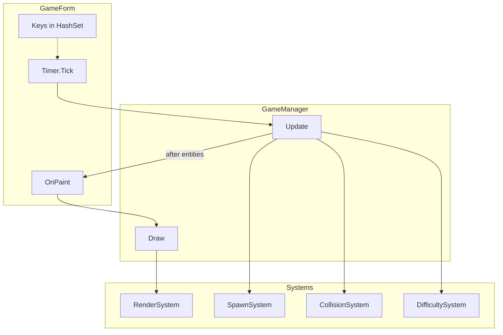

# Retro Blaster

**Retro Blaster** is a small, educational **retro-style 2D arcade** game for **Windows**, written in **C#** with **Windows Forms (WinForms)**. The player controls a cannon at the bottom of the screen, shoots upward, and destroys falling vertical “bar” enemies. The project uses **only** the .NET BCL and WinForms—**no game engines** and **no third-party NuGet packages**—so the code stays easy to read, learn from, and modify.

Simulation and rendering are split into a thin **`Game.Core.GameManager`** orchestrator plus **`Game.Core.GameState`**, **`Game.Core.EntityManager`**, and small **`Game.Systems.*`** classes (spawn, collision, difficulty, render) so responsibilities stay clear without a heavy framework.

---

## Table of contents

1. [Tech stack](#tech-stack)
2. [Features](#features)
3. [Game rules & mechanics](#game-rules--mechanics)
4. [Project structure & architecture](#project-structure--architecture)  
   - [Repository layout](#repository-layout)
5. [Architecture & design](#architecture--design)
6. [Implementation overview](#implementation-overview)
7. [Requirements](#requirements)
8. [Build and run](#build-and-run)
9. [Controls](#controls)  
   - [Dev mode hotkeys (Debug builds only)](#dev-mode-hotkeys-debug-builds-only)
10. [UI layout](#ui-layout)
11. [How the game loop works](#how-the-game-loop-works)
12. [Tuning & constants](#tuning--constants)
13. [Design notes & limitations](#design-notes--limitations)

---

## Tech stack

| Layer | Technology | Notes |
|--------|------------|--------|
| **Language** | C# | Nullable reference types enabled (`<Nullable>enable</Nullable>`). |
| **Runtime / SDK** | .NET 8 | Windows-only project (`net8.0-windows`). |
| **UI framework** | Windows Forms | `UseWindowsForms` in the project file; main window is a `Form`. |
| **Graphics** | **GDI+** via `System.Drawing` | `Graphics`, `Pen`, `Brush`, `Rectangle`, `Color`, `Font`, `SmoothingMode`, etc. Gameplay rendering runs from `GameForm.OnPaint` → `RenderSystem.Draw` (not per-entity controls). |
| **Game loop** | **`System.Windows.Forms.Timer`** (~**16 ms**) + **`Stopwatch`** | **`WM_TIMER`** drives **`GameLoopTick`**: one **`GameManager.Update`** per tick and **`Invalidate`** every tick (including **pause**), so **`OnPaint`** keeps running and overlays stay visible. **`Stopwatch`** measures real elapsed time between ticks (passed as **`deltaSeconds`**) for HUD / future tuning — avoids **`Application.Idle`** tight-spin starving **`WM_PAINT`**. |
| **Input** | Keyboard + WinForms controls | `KeyPreview` on the form, `KeyDown` / `KeyUp`, and a `HashSet<Keys>` for held keys. **Space (held)** with a **~100 ms** cooldown in `GameManager` for auto-fire. **ESC** toggles pause/resume (disabled during life-lost and game-over states). **F1** toggles debug draw in all builds. **F2** and dev **1–6** hotkeys are compiled only under **`#if DEBUG`** (`GameForm`, `GameManager.ToggleDevMode` / `TryDevActivatePowerUpDigit`); **Release** builds cannot turn dev mode on from the keyboard, and **`ResetRun`** forces **`IsDevMode = false`** (`#if !DEBUG` in `GameState`). During life-lost pause, **Enter/Space** continues. |
| **Entry point** | `Program.cs` | `[STAThread]`, `ApplicationConfiguration.Initialize()` (high-DPI / WinForms bootstrap in modern .NET), `Application.Run(new GameForm())`. |
| **Build output** | `WinExe` | Assembly name `RetroArcade`, root namespace `Game`. |
| **Solution** | `ArcadeGame.sln` | Optional; includes `ArcadeGame.csproj` for **Visual Studio** and CLI workflows. |

**Not used:** Unity, MonoGame, SDL, Skia, WPF, DirectX wrappers, or any external libraries for rendering, audio, or physics.

---

## Features

### Gameplay

- **Cannon (player)** — Rectangle at the **bottom** of the play area; horizontal movement is **discrete steps** (half bar width), **grid-snapped**, with a **per-direction cooldown** so holding a key does not move every frame.
- **Lives system** — Each run starts with **3 lives**. A bar reaching the floor removes one life instead of ending immediately. The run ends only when lives reach **0**.
- **Bullets** — Fired **straight up**; many bullets can exist at once. Off-screen removal when they leave the **top** of the play area.
- **Enemies (bars)** — **Vertical** rectangles that **fall** from the top. Width comes from **`SpawnSystem.BarWidth`** (24 px); height and type vary by **`BarType`** (Normal, Fast, Tank).
- **Core mechanic: bars do not vanish on first hit** — Each hit applies **`GameManager.DamagePerHit`** (20) to **height**; the bar’s **top** stays fixed, so the bar **shrinks from the bottom upward**. When **height ≤ 0**, the bar is removed, **score** increases by the **combo multiplier** (see [Game rules](#game-rules--mechanics)), and global fall speed is recomputed from the new score.
- **Life loss / game over** — If a bar reaches the floor (and dev mode is off), **`GameState.TryConsumeShield()`** runs first: with **`ShieldCharges`** active, the bar is removed, **no life is lost**, and shield feedback (sound, cyan ring burst, flash, light shake) plays. Otherwise **`GameState.LoseLife()`** is called. If lives remain, the playfield is cleared and **`ResetAfterLifeLost`** runs, then the game enters a paused **`IsLifeLost`** state until the player continues. If lives are depleted, existing game-over flow runs (`ApplyGameOverShakeAndClearMuzzle`). **Dev mode** (`GameState.IsDevMode`): bars that reach the floor are **removed** with a short shake and **do not** cost a life (shield still consumes first if active).
- **Progressive difficulty (fall speed)** — Global bar speed is **`round(BaseBarSpeed + √score × factor)`**, clamped between **`MinBarSpeed`** and **`MaxBarSpeed`** in [`DifficultySystem`](Systems/DifficultySystem.cs). No step-based jumps. After each destroy, **`SyncBarSpeedFromScore`** updates **`GameState.BarSpeed`** and calls **`Bar.SetTargetMoveSpeed`** on existing bars; each bar **lerps** its fall speed toward that target every frame (**`TickSpeedTowardTarget`** before **`Move`**). New spawns still **`SetMoveSpeed`** to snap current + target. **Dev mode** further **caps `BarSpeed` at 2** after the score curve.
- **Progressive difficulty (spawn rate)** — Every **120 frames** while playing, **`DifficultySystem.Tick`** can tighten or relax **`SpawnIntervalFrames`** (floored at a minimum). Kill bursts (≥ kills in window) tighten spawns further; zero kills in the window slightly relax them. **Bar speed** is not changed here—only the sqrt(score) path. **Dev mode** skips these spawn-interval tighten/relax steps so the stored interval stays high unless you turn dev off.
- **Non-overlapping spawns** — New bars must pass both checks: no **AABB overlap** and minimum **horizontal spacing padding** from existing bar X positions. Placement uses bounded random retries, then a left-to-right scan fallback; if no valid slot exists, spawn is skipped for a short retry window.
- **Concurrent bar cap** — `MaxBarsOnScreen = min(10, 3 + ⌊score / 5⌋)` in **`GameState`**; **`SpawnSystem`** uses **`EffectiveMaxBarsOnScreen`**, which in dev mode is **`min(4, MaxBarsOnScreen)`** so the playfield stays readable while testing.
- **Damage & collisions** — Bullet vs bar uses **`Rectangle.IntersectsWith`**. Spawn placement uses a custom **AABB overlap** test.
- **Immediate power-up activation** — Collected power-ups activate instantly on pickup and replace any current active effect (single-active model).
- **Power-up drop consistency** — Drops use a base random chance (**10%**) plus bad-luck protection: if no drop occurs for **12** destroyed bars, the next destroy forces a drop. **Dev mode** uses **~55%** per destroy and forces a drop after **3** bars without a drop ([`SpawnSystem.TrySpawnPowerUpAt`](Systems/SpawnSystem.cs)).

### User experience & presentation

- **Start gate** — Simulation does not advance until **Start** (or **Enter** as `AcceptButton`). After game over, **Play again** returns and the **idle-driven loop** stays off until a new start.
- **Muzzle / shot line** — Gold muzzle port and warm aim line align with **`Player.GetBulletSpawn`** / **`MuzzleTopCenter`**.
- **HUD** — Visual HUD with **life icons** (top-left), a boxed **SCORE** label+value (top-right), secondary **BEST** beneath it, emphasized **COMBO** when active, and a **centered active power-up card**: large colored glyph on top, short **uppercase** label beneath (**RAPID**, **MULTI**, **PIERCE**, **SHIELD**, **SLOW**, **BOMB**), plus a **timer bar** when the effect is timed.
- **Overlays** — Attract: **READY?** + start hint. Pause: semi-transparent overlay with **PAUSED** and an ESC continue hint. Life lost: semi-transparent overlay with **LIFE LOST**, remaining life icons, and continue hint. Game over: darker/stronger overlay with bigger title text.
- **Status bar** — Docked bottom **`Panel` + `Label`**; play height = client height minus bar height; **`OnPaint`** clips to the play rectangle.
- **Double-buffered** form to reduce flicker.

### Gameplay & polish

- **Hit feedback** — **`Bar.HitFlashTimer`** + **`TickEffect`** for a short light flash on damage.
- **Particles** — 2×2 squares on impact; stored in **`EntityManager.Particles`**.
- **Bar types** — **Normal**, **Fast** (higher per-type speed scale, shorter height band), **Tank** (lower scale, taller). Target pixel speed derives from global bar speed × type scale; motion eases toward that target (**`Bar`** lerp).
- **Health color** — Green → gold → red from **`HealthRatio`**; flash color overrides while flashing.
- **Combo** — Destroys within **`ComboTimeWindowFrames`** (90) raise streak; points per destroy = **`min(streak, ComboMaxMultiplier)`** (multiplier cap 4).
- **Spawn patterns** — **Cluster** (~15%): 1–2 extra bars with small X offset. **Lane** (~10%): next spawn may reuse the same X column.
- **Firing** — Hold **Space**; **100 ms** cooldown between shots (`GameState.LastFireTimeMs`).
- **Background** — Vertical dark gradient + low-contrast grid (**`RenderSystem`**).
- **Danger line** — Horizontal guide; pen warms when any bar’s bottom crosses it.
- **Player / shots** — Cyan cannon, gold muzzle, aim line, short **muzzle flash** on fire, faint **cyan bullet trails**. **Piercing Shot** rounds are **wider**, **magenta/purple** core + soft glow, and **magenta dual trails** so they read differently from normal shots.
- **Bars** — Thin dark outline for separation from the grid.
- **Screen shake** — ~1 px for a short time on destroy, life lost, and game over; **bomb detonation** adds a separate **~2 px** pattern for **`BombHeavyShakeFrames`** while the flash fades. **Shield block** uses a small dedicated shake pattern (**`ShieldImpactShakeFrames`**) plus **`ShakeUntilTickMs`** extension from **`TryConsumeShield`** (does not stack with bomb’s heavy shake while bomb frames run).
- **Life-lost flash** — Short red flash fade (`LifeLostFlashFrames`) when a life is consumed.
- **Power-ups** — Destroyed bars can drop collectibles: Rapid Fire, Multi Shot, Piercing Shot, Shield, Slow Motion, Bomb Shot. Effects are applied immediately on collection. The HUD uses a **visual-first** slot: each type has a **distinct color** and **simple drawn symbol** (speed streaks, triple dots, diamond, shield path, clock arc, bomb+fuse) in [`RenderSystem`](Rendering/RenderSystem.cs) (`DrawPowerUpGlyph` / `GetPowerUpHudLabel`), not long technical names. Timed effects show a **progress bar** under the label when `ActivePowerUpDurationFrames` is set. **Bomb Shot** does **not** use bullets: on pickup, **`GameState`** stores a **random point** in the playfield and a **frame fuse** (~12–31 frames ≈ **200–500 ms**); [`RenderSystem.DrawBombFuseIndicator`](Rendering/RenderSystem.cs) shows a pulsing marker; when the fuse hits zero, **`CollisionSystem.ExecuteBombExplosionAt`** runs a **hybrid cull**: active bars are **sorted by danger** (lowest on screen / largest **bottom** Y first, then distance to the blast point), then **`floor(count × 0.72)`** of them are **destroyed** (capped so at least one bar can survive when **count ≥ 2**); remaining bars inside a **splash radius** take extra damage. Culled bars are **`DestroyBarAt`**’d **over several frames** in **distance order** (closest to the blast center first; **`CollisionSystem.TickPendingBombKills`**). **`ExplosionFx`** uses a **smooth-expanding** triple shockwave (**`ExpansionT`** easing, **`MaxWaveRadius`** ~168); **`DrawBombScreenFlash`** adds a brief **white/yellow** full-screen fade (`BombScreenFlashFrames`); see [Dev mode hotkeys](#dev-mode-hotkeys-debug-builds-only) for tester shortcut **3**.
- **Drop trigger coverage** — Drop roll runs on **every destroyed bar** through the collision-destroy path, using the same shared `Random` instance owned by `GameManager` (no per-frame re-creation).
- **Start / Play again** — Large flat button, border, hover highlight (**`GameForm`**).
- **Audio** — Procedural mono **44.1 kHz** sine WAV in memory (**`SoundGenerator`**), **cosine envelope**, **`SoundPlayer`** pool (12 slots) for overlapping **`Play()`**; **`GameAudio`** exposes shoot / hit / game over / **shield pickup** / **shield block** / **pierce hit**.
- **High score** — **`highscore.json`** via **`HighScoreStore`**; shown as **BEST**.
- **Debug (F1)** — Hitboxes, FPS (from form), entity counts; smaller, dimmer font.
- **Dev mode (Debug builds only)** — **`GameState.IsDevMode`** is toggled with **F2**; number keys **1–6** (main row or numpad) grant power-ups while a run is active—see the [key table](#dev-mode-hotkeys-debug-builds-only). Compiled only with **`DEBUG`** (`#if DEBUG` in **`GameForm`** / **`GameManager.ToggleDevMode`**; **`TryDevActivatePowerUpDigit`** is empty in Release). Not cleared on **Start** / **Play again** while debugging. While on: easier difficulty (see above), boosted power-up drops, no life loss when a bar touches the floor. **Release** builds: dev flag is cleared on each **`ResetRun`**; gameplay dev branches never activate. Overlay: [`RenderSystem.DrawDevModeOverlay`](Rendering/RenderSystem.cs).

---

## Game rules & mechanics

### Objective

Clear falling **bars** before they reach the **bottom** of the playfield. Each full **destroy** adds **score** (combo-based). Survive as long as possible; **best score** persists to disk.

### Player

| Rule | Detail |
|--------|--------|
| **Position** | Integer **X**, bottom-aligned **Y** = `playHeight − height` each frame. |
| **Movement** | Step size = **`SpawnSystem.BarWidth / 2`** (12 px). **`TryStep(±1)`** with **`ClampAndSnapToGrid`** so X stays on a step grid and inside `[0, clientWidth − width]`. |
| **Input cadence** | **75 ms** minimum between steps **per direction** (`GameState.LastPlayerStepLeftMs` / `RightMs`). |
| **Firing** | **`TryFire`**: 4×10 px bullet, speed **10** px/frame upward; only while `IsPlaying`, not game over, and not paused. |
| **Pause** | **ESC** toggles `IsPaused`; when paused, gameplay update logic is skipped. |
| **Life-lost pause** | While `IsLifeLost` is true, gameplay update logic is paused until continue input/button. |

### Combat & scoring

| Rule | Detail |
|--------|--------|
| **Damage** | **`DamagePerHit`** = **20** per bullet impact; bullet is removed; bar **`ApplyDamage`**. |
| **Hit feedback** | **`RegisterHit`** sets flash timer; **`GameAudio.PlayHit`**; impact **particles**. **Piercing Shot** hits use **`RegisterPierceHit`** (longer magenta bar flash), **`GameAudio.PlayPierceHit`**, and **magenta-tinted** impact particles. |
| **Destroy** | When **`Height ≤ 0`**: bar removed, **`GameState.RegisterBarDestroyed`** runs, then **`DifficultySystem.SyncBarSpeedFromScore`**. |
| **Combo** | If previous destroy was within **90 frames**, **`_combo`** increments; else reset to **1**. **Points added** = **`ComboMultiplier`** = **`min(_combo, 4)`**. |
| **High score** | If new **Score** beats stored best, **`HighScoreStore.TrySaveIfBetter`** writes JSON. |
| **Kills window** | **`KillsInWindow`** increments on destroy; **`DifficultySystem.Tick`** (every 120 frames) uses it only for **spawn interval** nudges, then resets the window to 0. |

### Difficulty (fall speed)

Global speed integer **`BarSpeed`** stored in **`GameState`**, computed from **score** only (smooth, no discrete “every N kills” steps):

\[
\text{BarSpeed} = \mathrm{clamp}\Bigl(\mathrm{round}(\texttt{BaseBarSpeed} + \sqrt{\max(0,\text{Score})} \times \texttt{SpeedSqrtFactor}),\ \texttt{MinBarSpeed},\ \texttt{MaxBarSpeed}\Bigr)
\]

Current constants (see **`DifficultySystem`**): **`BaseBarSpeed`** ≈ 1.05, **`SpeedSqrtFactor`** = 0.12, **`MinBarSpeed`** = 1, **`MaxBarSpeed`** = 4. Each **`Bar`** maps global speed × type scale to a **target** fall speed, then **lerps** current speed toward it each frame (**`SpeedLerpFactor`** in **`Bar`**).

### Spawning & density

| Rule | Detail |
|--------|--------|
| **Countdown** | **`SpawnCountdown`** decrements each spawn attempt; on success reset to **`EffectiveSpawnIntervalFrames`** (in dev mode, at least **72** frames even if internal **`SpawnIntervalFrames`** fell lower); on hard failure use short **`BarSpawnRetryFramesWhenNoFit`**. |
| **Max on screen** | Normal: **`min(10, 3 + Score / 5)`**. Dev: **`min(4, that value)`** via **`EffectiveMaxBarsOnScreen`** — blocks **`TrySpawn`** and **`TryCreateBarAt`**. |
| **Lane** | **`NextSpawnLaneX`** may force the next primary spawn X. |
| **Cluster** | Extra bars after a successful primary place, same cap and overlap rules. |

### Lose condition

If **any** bar has **`Y + Height ≥ playHeight`**: if **dev mode** is on, the bar is removed without life loss. Else if **`TryConsumeShield()`** succeeds (one shield charge in **`ShieldCharges`**), the bar is removed and the player keeps the life. Otherwise consume one life. If lives remain, clear entities, reset volatile timers, set **`IsLifeLost`**, and wait for continue. If lives reach 0, trigger game over + shake + stop playing + game-over sound; **`GameForm`** stops the **run loop** flag and shows **Play again**.

### Coordinates

WinForms standard: **origin top-left**, **Y** increases downward; bullets move by decreasing **Y**.

---

## Project structure & architecture

### Repository layout

Source files are grouped by responsibility under top-level folders. Build outputs go under `bin/` and `obj/`.

```
Retro Blaster (repo root)
├── ArcadeGame.sln
├── ArcadeGame.csproj
├── Program.cs
├── Core/
│   ├── GameManager.cs
│   ├── GameState.cs
│   ├── EntityManager.cs
│   └── HighScoreStore.cs
├── Entities/
│   ├── Player.cs
│   ├── Bar.cs
│   ├── Bullet.cs
│   ├── Particle.cs
│   ├── BarType.cs
│   ├── PowerUp.cs
│   └── PowerUpType.cs
├── Systems/
│   ├── SpawnSystem.cs
│   ├── CollisionSystem.cs
│   └── DifficultySystem.cs
├── Rendering/
│   └── RenderSystem.cs
├── Audio/
│   ├── GameAudio.cs
│   └── SoundGenerator.cs
├── UI/
│   └── GameForm.cs
└── readme.md
```

At runtime, **`highscore.json`** may appear next to **`RetroArcade.exe`** after a new best score is saved.

### Source files (reference)

| File | Role |
|------|------|
| `ArcadeGame.csproj` | `net8.0-windows`, `WinExe`, `UseWindowsForms`, nullable, implicit usings. |
| `Program.cs` | `[STAThread]`; starts **`Game.UI.GameForm`**. |
| `UI/GameForm.cs` | **`Forms.Timer`** tick, **`Stopwatch`** delta per tick, keys, **Start / Continue / Play again** button flow, status strip, clip + **`Game.Core.GameManager.Draw`**, FPS sample for debug. |
| `Core/GameManager.cs` | **`DamagePerHit`**; **`Game.Entities.Player`**; composes **`Game.Core.GameState`**, **`Game.Core.EntityManager`**, **`Game.Systems.DifficultySystem`**, **`Game.Systems.CollisionSystem`**, **`Game.Systems.SpawnSystem`**, **`Game.Rendering.RenderSystem`**. Floor-hit handling respects dev mode; **`ToggleDevMode`** / **`TryDevActivatePowerUpDigit`**. |
| `Core/GameState.cs` | Run data; reset flows; combo/lives/high-score/new-best/pause flags; difficulty and cadence fields; **`IsDevMode`** and effective spawn/cap helpers for dev tuning. |
| `Core/EntityManager.cs` | **`Bars`**, **`Bullets`**, **`Particles`**; update and culling helpers. |
| `Core/HighScoreStore.cs` | JSON load/save for best score. |
| `Systems/SpawnSystem.cs` | **`TrySpawn`**, overlap/spacing validation, types/heights, **`BarWidth`**. |
| `Systems/CollisionSystem.cs` | **`Resolve`**: hits, audio/particles, destroy hooks. |
| `Systems/DifficultySystem.cs` | Score-based speed curve + spawn interval cadence. |
| `Rendering/RenderSystem.cs` | Full GDI+ draw path (world, HUD, overlays, debug). |
| `Entities/*` | Domain entities: player, bars, bullets, particles, bar type enum. |
| `Audio/*` | Procedural SFX (`GameAudio`, `SoundGenerator`). |

**Data flow:** `Timer.Tick` → **`Stopwatch`** elapsed → **`GameManager.Update(..., deltaSeconds)`** → **`Invalidate`** → **`OnPaint`** → **`RenderSystem.Draw`** (via **`GameManager.Draw`**).

---

## Architecture & design

### Goals

- **Readable** — Small types, explicit wiring in **`GameManager`**, no DI container, no ECS.
- **WinForms-first** — Single UI thread; **`Forms.Timer`** drives sim cadence; **`Invalidate`** + **`OnPaint`** drive draw.
- **BCL-only** — Drawing, audio, JSON only from the framework.

### Layering

| Layer | Responsibility |
|--------|----------------|
| **`GameForm`** | Window, keyboard set, **`Timer`** + **`Stopwatch`**, Start/Continue/Play again button flow, status text, play height, clip, invalidate. |
| **`GameManager`** | Orchestration: call order for state, entities, systems; owns **`Player`** and firing cooldowns. |
| **`GameState`** | Authoritative mutable run fields (no systems referenced). |
| **`EntityManager`** | Three lists; movement/cull helpers. |
| **`SpawnSystem`**, **`CollisionSystem`**, **`DifficultySystem`**, **`RenderSystem`** | Use state + entities (+ **`Random`** where needed); plain constructors. |
| **`GameAudio` / `SoundGenerator` / `HighScoreStore`** | SFX and persistence at the edges. |

Namespace map (matches folders):
- `Game.Core` → orchestration and run state
- `Game.Entities` → player/bars/bullets/particles
- `Game.Systems` → spawn/collision/difficulty rules
- `Game.Rendering` → draw pipeline and HUD/overlays
- `Game.Audio` → procedural SFX
- `Game.UI` → WinForms host form
- `Game` → entry point (`Program.cs`)



### Simulation order (`GameManager.Update`)

1. **`GameState.AdvanceFrame(deltaSeconds)`** — frame index, muzzle decay, combo timeout; stores **`LastDeltaSeconds`** for debug / future tuning.
2. **Player** — bottom align, horizontal steps, **`ProcessFiring`**.
3. **`EntityManager`** — bullets, particles, bars (move + tick).
4. **Life-lost pause gate** — if `IsLifeLost`, update returns early (no normal gameplay simulation).
5. **Lose check** — any bar reaches floor → **`LoseLife()`**. If lives remain: clear entities + **`ResetAfterLifeLost`** (+ slight spawn easing) and set `IsLifeLost`; if depleted: game-over branch and **return**.
6. **`CollisionSystem.Resolve`** — may destroy bars and change score/speed.
7. **`SpawnSystem.TrySpawn`** — if not game over.
8. **`DifficultySystem.Tick`** — periodic spawn interval adjust.

### Render order (`RenderSystem.Draw`)

Shake transform → background + grid → danger line → bars (fill + outline) → particles → bullet trails → bullets (cyan default vs **magenta pierce** + glow) → player + muzzle + flash → **shield ring / pickup pulse / block burst (player)** → visual HUD (icons + score boxes) → life-lost flash/overlay or attract/game-over overlay → debug.

### Difficulty design (summary)

| Lever | Role |
|--------|------|
| **Sqrt(score) speed** | Smooth global cap; on destroy targets update immediately, bar motion **eases** over frames toward the new target. |
| **Spawn interval** | Tightens/relaxes on a 120-frame cadence and kill-window stats. |
| **Max bars on screen** | Score-based ceiling independent of sqrt speed. |
| **Types & patterns** | Variety without replacing the core formulas. |

### Audio

**`SoundGenerator`** writes RIFF/WAVE PCM into **`MemoryStream`**, **`Load`**, **`Play()`**; streams kept alive per pool slot until replaced. **`GameAudio`** is the gameplay-facing API.

### Persistence

**`HighScoreStore`** is the only JSON touchpoint for best score; invoked from **`GameState.RegisterBarDestroyed`** and **`ResetRun`**.

---

## Implementation overview

| Concern | Primary types |
|--------|----------------|
| **Lifecycle / attract / new run** | **`GameManager`** (`EnterAttractMode`, `StartNewGame`, `ResetState`, `Initialize`). |
| **Authoritative run numbers** | **`GameState`** (score, lives, flags including `IsLifeLost`, spawn countdown/interval, `BarSpeed`, combo, active power-up/timer, shake/flash, input timers). |
| **World lists** | **`EntityManager`** (bars, bullets, particles, power-up drops—**not** the player). |
| **Creating enemies** | **`SpawnSystem`** (random + lane + cluster + overlap + cap). |
| **Hits & destroys** | **`CollisionSystem.Resolve`**: normal bullets stop on first bar; **piercing** bullets use **`Bullet.ConsumePierce`** and a **repeat** pass in the same frame so stacked/overlapping bars can all take damage until the bullet runs out of pierce budget or no longer intersects anything (damage constant from **`GameManager`**). |
| **Power-up activation** | **`GameManager`** + **`GameState`** (pickup activates immediately; one active power-up at a time). **Shield**: one charge (**`ShieldCharges`**), HUD **SHIELD**, cyan ellipse + glow on the player (**`RenderSystem.DrawShieldPlayerFx`**), pickup pulse + **`GameAudio.PlayShieldPickup`**, floor block via **`TryConsumeShield`** (ring burst, flash, **`PlayShieldBlock`**). **Bomb**: fuse + **`ExecuteBombExplosionAt`**, then staggered **`TickPendingBombKills`** + screen flash / heavy shake + **`ExplosionFx`**. |
| **Speed curve + spawn cadence** | **`DifficultySystem`**. |
| **Drawing** | **`RenderSystem`** (all GDI+ for the playfield). |

**Construction order inside `GameManager`:** `DifficultySystem` → `CollisionSystem` (needs difficulty for post-destroy **`SyncBarSpeedFromScore`**) → `SpawnSystem` → `RenderSystem` is stateless and created inline.

---

## Requirements

- **OS:** Windows (WinForms + `net8.0-windows`).
- **SDK:** [.NET 8 SDK](https://dotnet.microsoft.com/download) (or compatible tooling that can build this TFM).
- **IDE (optional):** Visual Studio 2022+ (.NET desktop workload), or VS Code + C# + `dotnet` CLI.

---

## Build and run

### .NET CLI

```bash
dotnet build
dotnet run
```

Release example: `dotnet run -c Release`

Output: `bin/<Configuration>/net8.0-windows/RetroArcade.exe` (see **`AssemblyName`** in the csproj).

### Visual Studio

Open **`ArcadeGame.sln`**, set startup project, F5 or Ctrl+F5.

---

## Controls

| Action | Input |
|--------|--------|
| **Move left** | **Left** or **A** |
| **Move right** | **Right** or **D** |
| **Fire** | **Hold Space** (~100 ms cooldown) |
| **Pause / resume** | **ESC** (disabled during life-lost and game-over screens) |
| **Lives** | Start with **3**; life loss clears only playfield + temporary timers (score/difficulty preserved) |
| **Continue after life loss** | **Enter** or **Space**, or click **Continue** button |
| **Start / play again** | Button or **Enter** (`AcceptButton`) |
| **Debug overlay** | **F1** (hitboxes, FPS, counts) |
| **Dev mode** | **Debug configuration only:** **F2** toggles dev on/off. **1–6** grant power-ups during play when dev is on—see [Dev mode hotkeys](#dev-mode-hotkeys-debug-builds-only). **Release:** no keyboard toggle; **`IsDevMode`** stays false. |
| **Focus** | Form calls **`Focus()`** on start; click client/title if keys stop responding |

### Dev mode hotkeys (Debug builds only)

These keys exist only in **Debug** builds (`#if DEBUG` in **`GameForm`**). **`GameManager.TryDevActivatePowerUpDigit`** maps digits to **`PowerUpType`** ([`GameManager.cs`](Core/GameManager.cs)). Use **main row** **1–6** or **NumPad 1–6**. Requires **dev mode on** (**F2**), **`IsPlaying`**, and not paused / life-lost.

| Key | Grants (`PowerUpType`) | HUD label (after grant) | Notes |
|-----|------------------------|-------------------------|--------|
| **F2** | — | — | Toggles **`IsDevMode`** on/off. |
| **1** | `RapidFire` | **RAPID** | Faster fire for a timed window. |
| **2** | `MultiShot` | **MULTI** | Triple shot for a timed window. |
| **3** | `BombShot` | *(none — bomb is not a timed HUD buff)* | Same as a normal pickup: random fuse point in the playfield, then AoE explosion (no shooting). |
| **4** | `PiercingShot` | **PIERCE** | Timed buff: new bullets get pierce budget (**up to 3 bars** per shot with current **`GetPierceCount()`** = 2), magenta visuals + **`PlayPierceHit`**. |
| **5** | `Shield` | **SHIELD** | One shield charge (no timer bar). |
| **6** | `SlowMotion` | **SLOW** | Slower bar fall for a timed window. |

---

## UI layout

- **Default client size** — `480×640` (client area, excluding window chrome).
- **Play area** — Full width × (client height − status bar, height **30**).
- **HUD (in-play overlay)** — Top-left lives label + heart icons, top-right score box, best score text under it, combo text when active, and a **centered power-up card** (large glyph, uppercase short label, optional timer bar). Empty slot shows a dim placeholder ellipse. Temporary banners like **NEW BEST!** when applicable. **Dev mode** adds a small **DEV MODE** block (lower-left of the play area, above the F1 FPS line) with live tuning readouts.
- **Active power-up card (top-center)** — Implemented in **`RenderSystem.DrawPowerUpHud`** / **`DrawActivePowerUpCard`**. Layout: **~36×36 px** colored glyph inside a white ring, **7 pt bold** label centered under the icon, **4 px** timer strip when the run state exposes a finite duration. **Type → color / symbol / label** (all `System.Drawing` primitives):

  | `PowerUpType` | HUD label | Color (fill) | Glyph idea |
  |---------------|-----------|----------------|------------|
  | `RapidFire` | RAPID | Orange | Filled circle + forward streak lines |
  | `MultiShot` | MULTI | Deep sky blue | Three filled circles in a row |
  | `PiercingShot` | PIERCE | Medium purple | Diamond (rotated square) |
  | `Shield` | SHIELD | Light cyan (`ARGB` ~70,210,255) | Curved “shield” path (`GraphicsPath`) |
  | `SlowMotion` | SLOW | Cyan | Filled circle + clock arc + hand |
  | `BombShot` | BOMB | Orange red | Oval body + fuse line |

- **Start button** — Centered horizontally, above bottom margin in play coords; hidden during a run; flat style with hover.

---

## How the game loop works

1. **`Timer.Tick`** → **`GameForm`** reads **`HashSet<Keys>`** and **`Stopwatch`** elapsed → **`GameManager.Update(w, h, left, right, fire, deltaSeconds)`** → **`Invalidate`** → **`OnPaint`**.
2. **`Update`** early-outs if not playing, paused, or playfield too short.
3. Subsystems run in the order listed under [Simulation order](#architecture--design).
4. **`Invalidate`** → **`OnPaint`** clips to play rect → **`GameManager.Draw`** → **`RenderSystem.Draw`**.
5. All work stays on the **UI thread**.

---

## Tuning & constants

| Area | Where to look |
|------|----------------|
| **Damage per hit** | **`GameManager.DamagePerHit`** (20). |
| **Fire cadence** | **`GameManager`** — `FireCooldownMs`. |
| **Player step / cooldown** | **`GameManager`** — `PlayerStepCooldownMs`; step = **`SpawnSystem.BarWidth / 2`**. |
| **Bullet size / speed** | **`GameManager.TryFire`** literals. |
| **Player size** | **`GameManager.Initialize`** (`pw`, `ph`). |
| **Fall speed curve** | **`DifficultySystem`** — `BaseBarSpeed`, `SpeedSqrtFactor`, `MinBarSpeed`, `MaxBarSpeed`. |
| **Spawn timing** | **`DifficultySystem`** — `InitialSpawnIntervalFrames`, `MinSpawnIntervalFrames`, `KillsPerDifficultyWindow`; **`SpawnSystem`** — retry, cluster/lane chances, placement attempts. Dev mode skips interval tighten/relax in **`Tick`**. |
| **Max bars on screen** | **`GameState`** — `MaxBarsOnScreenBase`, `MaxBarsOnScreenScoreStep`, `MaxBarsOnScreenHardCap`; dev uses **`EffectiveMaxBarsOnScreen`**. |
| **Dev mode** | **`GameState.IsDevMode`** (forced **off** on **`ResetRun`** in Release via **`#if !DEBUG`**). **`GameManager.ToggleDevMode`** and **`TryDevActivatePowerUpDigit`** bodies are **`#if DEBUG`** only; **`GameForm`** wraps **F2** and digit handling in **`#if DEBUG`**. Overlay **`RenderSystem.DrawDevModeOverlay`**. |
| **Bomb pickup** | Fuse + **`ExecuteBombExplosionAt`**: splash immediately; **kill queue** + **`TickPendingBombKills`** (stagger **3** frames between cull destroys). **`GameState`**: **`TriggerBombImpactFx`**, **`BombScreenFlashFrames`**, **`BombHeavyShakeFrames`**. **`ExplosionFx`**: ~**48** frames, **`MaxWaveRadius`** ~**168**. |
| **Combo** | **`GameState`** — `ComboTimeWindowFrames`, `ComboMaxMultiplier`. |
| **Bar height / type odds** | **`SpawnSystem`** private ranges and **`RollBarType`**. |
| **Window / timer / status** | **`GameForm`** — client size, timer interval, **`Stopwatch`** delta clamp, status strings. |

Rebuild after edits and smoke-test movement, spawn cap, combo, power-up activation, audio, and high score save.

---

## Design notes & limitations

- **Teaching focus** — Prefer reading **`GameManager`** then one system at a time; no hidden magic from frameworks.
- **Rendering** — One paint path through **`RenderSystem`**; no sprite controls.
- **Threading** — Single-threaded; huge entity counts could stutter.
- **Audio** — Procedural only; no bundled WAV assets.
- **Resize** — Fixed form border in the sample; resize still reclamps the player via **`OnClientResize`**.
- **Persistence** — Only **`highscore.json`**; no settings file.
- **Growth** — Further splits can stay in the same assembly (partial classes or helpers) without introducing a full engine.

---

## License

No license file is provided in this sample repository. If you distribute or share the code, add a `LICENSE` file and/or copyright notice as appropriate for your use case.

---

## Credits

**Retro Blaster** — A minimal WinForms + GDI+ arcade sample: **`GameForm`** for hosting, **`GameManager`** for orchestration, **`GameState`** + **`EntityManager`** + **systems** for rules and presentation, and **`SoundGenerator`** for lightweight SFX.

For changes, run **`dotnet build`** frequently to catch regressions early.
