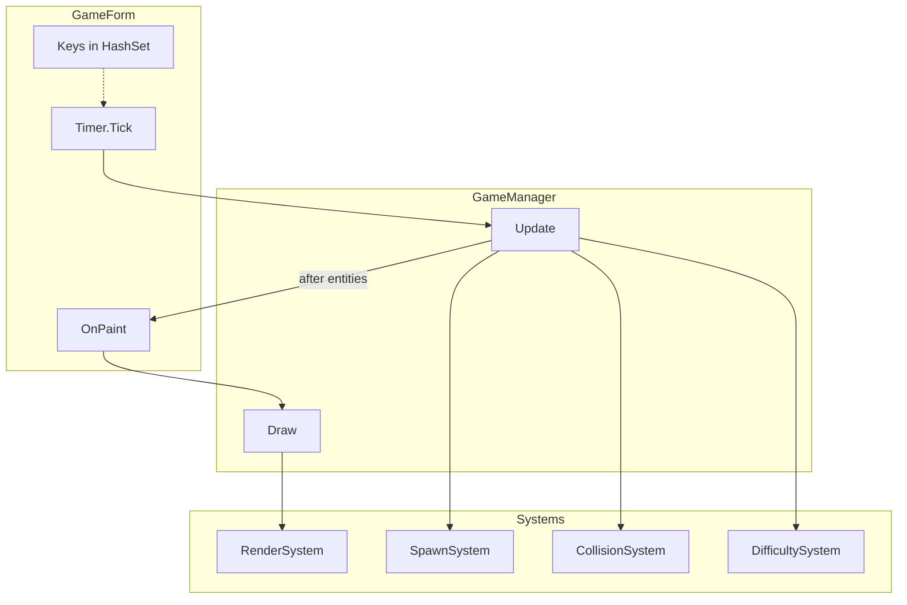

# Retro Blaster

**Retro Blaster** is a small, educational **retro-style 2D arcade** game for **Windows**, written in **C#** with **Windows Forms (WinForms)**. The player controls a cannon at the bottom of the screen, shoots upward, and destroys falling vertical “bar” enemies. The project uses **only** the .NET BCL and WinForms—**no game engines** and **no third-party NuGet packages**—so the code stays easy to read, learn from, and modify.

Simulation and rendering are split into a thin **`GameManager`** orchestrator plus **`GameState`**, **`EntityManager`**, and small **`*System`** classes (spawn, collision, difficulty, render) so responsibilities stay clear without a heavy framework.

---

## Table of contents

1. [Tech stack](#tech-stack)
2. [Features](#features)
3. [Game rules & mechanics](#game-rules--mechanics)
4. [Project structure & architecture](#project-structure--architecture)  
   - [Repository layout](#repository-layout)
5. [Architecture & design](#architecture--design)
6. [Implementation overview](#implementation-overview)
7. [Requirements](#requirements)
8. [Build and run](#build-and-run)
9. [Controls](#controls)
10. [UI layout](#ui-layout)
11. [How the game loop works](#how-the-game-loop-works)
12. [Tuning & constants](#tuning--constants)
13. [Design notes & limitations](#design-notes--limitations)

---

## Tech stack

| Layer | Technology | Notes |
|--------|------------|--------|
| **Language** | C# | Nullable reference types enabled (`<Nullable>enable</Nullable>`). |
| **Runtime / SDK** | .NET 8 | Windows-only project (`net8.0-windows`). |
| **UI framework** | Windows Forms | `UseWindowsForms` in the project file; main window is a `Form`. |
| **Graphics** | **GDI+** via `System.Drawing` | `Graphics`, `Pen`, `Brush`, `Rectangle`, `Color`, `Font`, `SmoothingMode`, etc. Gameplay rendering runs from `GameForm.OnPaint` → `RenderSystem.Draw` (not per-entity controls). |
| **Game loop** | `System.Windows.Forms.Timer` | Default interval **16 ms** (~62.5 ticks per second, close to **60 FPS**). |
| **Input** | Keyboard + WinForms controls | `KeyPreview` on the form, `KeyDown` / `KeyUp`, and a `HashSet<Keys>` for held keys. **Space (held)** with a **~100 ms** cooldown in `GameManager` for auto-fire. **F1** toggles debug draw. |
| **Entry point** | `Program.cs` | `[STAThread]`, `ApplicationConfiguration.Initialize()` (high-DPI / WinForms bootstrap in modern .NET), `Application.Run(new GameForm())`. |
| **Build output** | `WinExe` | Assembly name `RetroArcade`, root namespace `RetroArcade`. |
| **Solution** | `ArcadeGame.sln` | Optional; includes `ArcadeGame.csproj` for **Visual Studio** and CLI workflows. |

**Not used:** Unity, MonoGame, SDL, Skia, WPF, DirectX wrappers, or any external libraries for rendering, audio, or physics.

---

## Features

### Gameplay

- **Cannon (player)** — Rectangle at the **bottom** of the play area; horizontal movement is **discrete steps** (half bar width), **grid-snapped**, with a **per-direction cooldown** so holding a key does not move every frame.
- **Bullets** — Fired **straight up**; many bullets can exist at once. Off-screen removal when they leave the **top** of the play area.
- **Enemies (bars)** — **Vertical** rectangles that **fall** from the top. Width comes from **`SpawnSystem.BarWidth`** (24 px); height and type vary by **`BarType`** (Normal, Fast, Tank).
- **Core mechanic: bars do not vanish on first hit** — Each hit applies **`GameManager.DamagePerHit`** (20) to **height**; the bar’s **top** stays fixed, so the bar **shrinks from the bottom upward**. When **height ≤ 0**, the bar is removed, **score** increases by the **combo multiplier** (see [Game rules](#game-rules--mechanics)), and global fall speed is recomputed from the new score.
- **Game over** — If **any** bar’s bottom reaches or passes the **bottom** of the play area, the run ends (`GameState.ApplyGameOverShakeAndClearMuzzle`), timer stops, **Play again** appears.
- **Progressive difficulty (fall speed)** — Global bar speed is **`round(BaseBarSpeed + √score × factor)`**, clamped between **`MinBarSpeed`** and **`MaxBarSpeed`** in [`DifficultySystem`](DifficultySystem.cs). No step-based jumps. After each destroy, **`SyncBarSpeedFromScore`** updates **`GameState.BarSpeed`** and calls **`Bar.SetTargetMoveSpeed`** on existing bars; each bar **lerps** its fall speed toward that target every frame (**`TickSpeedTowardTarget`** before **`Move`**). New spawns still **`SetMoveSpeed`** to snap current + target.
- **Progressive difficulty (spawn rate)** — Every **120 frames** while playing, **`DifficultySystem.Tick`** can tighten or relax **`SpawnIntervalFrames`** (floored at a minimum). Kill bursts (≥ kills in window) tighten spawns further; zero kills in the window slightly relax them. **Bar speed** is not changed here—only the sqrt(score) path.
- **Non-overlapping spawns** — New bars only if their **AABB** does not overlap existing bars (edges may touch). Random attempts, then a **left-to-right scan** fallback. On failure, a **short retry countdown** applies.
- **Concurrent bar cap** — `MaxBarsOnScreen = min(10, 3 + ⌊score / 5⌋)` in **`GameState`**. Early runs stay sparse; cap rises with score. **`SpawnSystem.TryCreateBarAt`** enforces the cap on **all** spawn paths (lane, cluster, fallbacks).
- **Damage & collisions** — Bullet vs bar uses **`Rectangle.IntersectsWith`**. Spawn placement uses a custom **AABB overlap** test.

### User experience & presentation

- **Start gate** — Simulation does not advance until **Start** (or **Enter** as `AcceptButton`). After game over, **Play again** returns and the timer stays off until a new start.
- **Muzzle / shot line** — Gold muzzle port and warm aim line align with **`Player.GetBulletSpawn`** / **`MuzzleTopCenter`**.
- **HUD** — Stacked **SCORE** (white), **BEST** (gray), **COMBO** (orange) when streak &gt; 1; title **“Retro Blaster”** at top-left.
- **Overlays** — Attract: **READY?** + start hint. Game over: **semi-transparent fill**, then **GAME OVER** + **Click Start to play again**.
- **Status bar** — Docked bottom **`Panel` + `Label`**; play height = client height minus bar height; **`OnPaint`** clips to the play rectangle.
- **Double-buffered** form to reduce flicker.

### Gameplay & polish

- **Hit feedback** — **`Bar.HitFlashTimer`** + **`TickEffect`** for a short light flash on damage.
- **Particles** — 2×2 squares on impact; stored in **`EntityManager.Particles`**.
- **Bar types** — **Normal**, **Fast** (higher per-type speed scale, shorter height band), **Tank** (lower scale, taller). Target pixel speed derives from global bar speed × type scale; motion eases toward that target (**`Bar`** lerp).
- **Health color** — Green → gold → red from **`HealthRatio`**; flash color overrides while flashing.
- **Combo** — Destroys within **`ComboTimeWindowFrames`** (90) raise streak; points per destroy = **`min(streak, ComboMaxMultiplier)`** (multiplier cap 4).
- **Spawn patterns** — **Cluster** (~15%): 1–2 extra bars with small X offset. **Lane** (~10%): next spawn may reuse the same X column.
- **Firing** — Hold **Space**; **100 ms** cooldown between shots (`GameState.LastFireTimeMs`).
- **Background** — Vertical dark gradient + low-contrast grid (**`RenderSystem`**).
- **Danger line** — Horizontal guide; pen warms when any bar’s bottom crosses it.
- **Player / shots** — Cyan cannon, gold muzzle, aim line, short **muzzle flash** on fire, faint **bullet trails**.
- **Bars** — Thin dark outline for separation from the grid.
- **Screen shake** — ~1 px for a short time on destroy and on game over.
- **Start / Play again** — Large flat button, border, hover highlight (**`GameForm`**).
- **Audio** — Procedural mono **44.1 kHz** sine WAV in memory (**`SoundGenerator`**), **cosine envelope**, **`SoundPlayer`** pool (12 slots) for overlapping **`Play()`**; **`GameAudio`** exposes shoot / hit / game over.
- **High score** — **`highscore.json`** via **`HighScoreStore`**; shown as **BEST**.
- **Debug (F1)** — Hitboxes, FPS (from form), entity counts; smaller, dimmer font.

---

## Game rules & mechanics

### Objective

Clear falling **bars** before they reach the **bottom** of the playfield. Each full **destroy** adds **score** (combo-based). Survive as long as possible; **best score** persists to disk.

### Player

| Rule | Detail |
|--------|--------|
| **Position** | Integer **X**, bottom-aligned **Y** = `playHeight − height` each frame. |
| **Movement** | Step size = **`SpawnSystem.BarWidth / 2`** (12 px). **`TryStep(±1)`** with **`ClampAndSnapToGrid`** so X stays on a step grid and inside `[0, clientWidth − width]`. |
| **Input cadence** | **75 ms** minimum between steps **per direction** (`GameState.LastPlayerStepLeftMs` / `RightMs`). |
| **Firing** | **`TryFire`**: 4×10 px bullet, speed **10** px/frame upward; only while `IsPlaying` and not game over. |

### Combat & scoring

| Rule | Detail |
|--------|--------|
| **Damage** | **`DamagePerHit`** = **20** per bullet impact; bullet is removed; bar **`ApplyDamage`**. |
| **Hit feedback** | **`RegisterHit`** sets flash timer; **`GameAudio.PlayHit`**; impact **particles**. |
| **Destroy** | When **`Height ≤ 0`**: bar removed, **`GameState.RegisterBarDestroyed`** runs, then **`DifficultySystem.SyncBarSpeedFromScore`**. |
| **Combo** | If previous destroy was within **90 frames**, **`_combo`** increments; else reset to **1**. **Points added** = **`ComboMultiplier`** = **`min(_combo, 4)`**. |
| **High score** | If new **Score** beats stored best, **`HighScoreStore.TrySaveIfBetter`** writes JSON. |
| **Kills window** | **`KillsInWindow`** increments on destroy; **`DifficultySystem.Tick`** (every 120 frames) uses it only for **spawn interval** nudges, then resets the window to 0. |

### Difficulty (fall speed)

Global speed integer **`BarSpeed`** stored in **`GameState`**, computed from **score** only (smooth, no discrete “every N kills” steps):

\[
\text{BarSpeed} = \mathrm{clamp}\Bigl(\mathrm{round}(\texttt{BaseBarSpeed} + \sqrt{\max(0,\text{Score})} \times \texttt{SpeedSqrtFactor}),\ \texttt{MinBarSpeed},\ \texttt{MaxBarSpeed}\Bigr)
\]

Current constants (see **`DifficultySystem`**): **`BaseBarSpeed`** ≈ 1.05, **`SpeedSqrtFactor`** = 0.12, **`MinBarSpeed`** = 1, **`MaxBarSpeed`** = 4. Each **`Bar`** maps global speed × type scale to a **target** fall speed, then **lerps** current speed toward it each frame (**`SpeedLerpFactor`** in **`Bar`**).

### Spawning & density

| Rule | Detail |
|--------|--------|
| **Countdown** | **`SpawnCountdown`** decrements each spawn attempt; on success reset to **`SpawnIntervalFrames`**; on hard failure use short **`BarSpawnRetryFramesWhenNoFit`**. |
| **Max on screen** | **`min(10, 3 + Score / 5)`** — blocks **`TrySpawn`** early and **`TryCreateBarAt`**. |
| **Lane** | **`NextSpawnLaneX`** may force the next primary spawn X. |
| **Cluster** | Extra bars after a successful primary place, same cap and overlap rules. |

### Lose condition

If **any** bar has **`Y + Height ≥ playHeight`**: set game over + shake + stop playing + game-over sound; **`GameForm`** stops timer and shows **Play again**.

### Coordinates

WinForms standard: **origin top-left**, **Y** increases downward; bullets move by decreasing **Y**.

---

## Project structure & architecture

### Repository layout

Source and project files live at the solution root. Build outputs go under `bin/` and `obj/`.

```
Retro Blaster (repo root)
├── ArcadeGame.sln
├── ArcadeGame.csproj
├── Program.cs              # Entry → Application.Run(GameForm)
├── GameForm.cs             # Timer, input, status bar, Start button, OnPaint
├── GameManager.cs          # Orchestrator: lifecycle, player, fire, Update order
├── GameState.cs            # Score, flags, combo, spawn/speed fields, timers
├── EntityManager.cs        # Bars, bullets, particles + per-frame updates
├── SpawnSystem.cs          # Spawns, cap, cluster/lane, BarWidth
├── CollisionSystem.cs      # Bullet–bar resolution + hit particles
├── DifficultySystem.cs     # Sqrt(score) bar speed + spawn interval Tick
├── RenderSystem.cs         # Full playfield GDI+ draw
├── Player.cs
├── Bullet.cs
├── Bar.cs
├── BarType.cs
├── Particle.cs
├── SoundGenerator.cs
├── GameAudio.cs
├── HighScoreStore.cs
└── readme.md
```

At runtime, **`highscore.json`** may appear next to **`RetroArcade.exe`** after a new best score is saved.

### Source files (reference)

| File | Role |
|------|------|
| `ArcadeGame.csproj` | `net8.0-windows`, `WinExe`, `UseWindowsForms`, nullable, implicit usings. |
| `Program.cs` | `[STAThread]`; starts **`GameForm`**. |
| `GameForm.cs` | Timer tick, keys, **Start** / **Play again**, status strip, clip + **`GameManager.Draw`**, FPS sample for debug. |
| `GameManager.cs` | **`DamagePerHit`**; **`Player`**; composes **`GameState`**, **`EntityManager`**, **`DifficultySystem`**, **`CollisionSystem`**, **`SpawnSystem`**, **`RenderSystem`**; **`Update`** / **`Draw`** / resize / init. |
| `GameState.cs` | Run data; **`ResetRun`**, **`AdvanceFrame`**, **`RegisterBarDestroyed`**, **`MaxBarsOnScreen`**, **`ApplyGameOverShakeAndClearMuzzle`**. |
| `EntityManager.cs` | **`Bars`**, **`Bullets`**, **`Particles`**; **`Clear`**, **`UpdateBullets`**, **`UpdateParticles`**, **`UpdateBars`**. |
| `SpawnSystem.cs` | **`TrySpawn`**, overlap helpers, types/heights, **`BarWidth`**. |
| `CollisionSystem.cs` | **`Resolve`**: hits, audio/particles, destroy → state + **`SyncBarSpeedFromScore`**. |
| `DifficultySystem.cs` | **`ComputeBarSpeedFromScore`**, **`SyncBarSpeedFromScore`**, **`Tick`** (spawn interval only from time/kill window). |
| `RenderSystem.cs` | Shake, background, danger line, entities, HUD, overlays, debug. |
| `Player.cs` | Step + snap, muzzle, **`GetBulletSpawn`**. |
| `Bullet.cs` | Upward motion, **`GetBounds`**. |
| `Bar.cs` | Height, type, flash, **`SetMoveSpeed`** (spawn snap) / **`SetTargetMoveSpeed`** / **`TickSpeedTowardTarget`**, damage, bounds. |
| `BarType.cs` | **Normal**, **Fast**, **Tank**. |
| `Particle.cs` | Lifetime, velocity, gravity. |
| `SoundGenerator.cs` | In-memory WAV, pool of 12 **`SoundPlayer`** instances. |
| `GameAudio.cs` | **`PlayShoot`**, **`PlayHit`**, **`PlayGameOver`**. |
| `HighScoreStore.cs` | JSON load/save for best score. |

**Data flow:** `Timer.Tick` → keys → **`GameManager.Update`** → **`Invalidate`** → **`OnPaint`** → **`RenderSystem.Draw`** (via **`GameManager.Draw`**).

---

## Architecture & design

### Goals

- **Readable** — Small types, explicit wiring in **`GameManager`**, no DI container, no ECS.
- **WinForms-first** — Single UI thread; timer drives sim; paint drives draw.
- **BCL-only** — Drawing, audio, JSON only from the framework.

### Layering

| Layer | Responsibility |
|--------|----------------|
| **`GameForm`** | Window, keyboard set, timer, button, status text, play height, clip, invalidate. |
| **`GameManager`** | Orchestration: call order for state, entities, systems; owns **`Player`** and firing cooldowns. |
| **`GameState`** | Authoritative mutable run fields (no systems referenced). |
| **`EntityManager`** | Three lists; movement/cull helpers. |
| **`SpawnSystem`**, **`CollisionSystem`**, **`DifficultySystem`**, **`RenderSystem`** | Use state + entities (+ **`Random`** where needed); plain constructors. |
| **`GameAudio` / `SoundGenerator` / `HighScoreStore`** | SFX and persistence at the edges. |



### Simulation order (`GameManager.Update`)

1. **`GameState.AdvanceFrame`** — frame index, muzzle decay, combo timeout.
2. **Player** — bottom align, horizontal steps, **`ProcessFiring`**.
3. **`EntityManager`** — bullets, particles, bars (move + tick).
4. **Lose check** — any bar reaches floor → game over branch and **return**.
5. **`CollisionSystem.Resolve`** — may destroy bars and change score/speed.
6. **`SpawnSystem.TrySpawn`** — if not game over.
7. **`DifficultySystem.Tick`** — periodic spawn interval adjust.

### Render order (`RenderSystem.Draw`)

Shake transform → background + grid → danger line → bars (fill + outline) → particles → bullet trails → bullets → player + muzzle + flash → HUD → attract or game-over overlay → debug.

### Difficulty design (summary)

| Lever | Role |
|--------|------|
| **Sqrt(score) speed** | Smooth global cap; on destroy targets update immediately, bar motion **eases** over frames toward the new target. |
| **Spawn interval** | Tightens/relaxes on a 120-frame cadence and kill-window stats. |
| **Max bars on screen** | Score-based ceiling independent of sqrt speed. |
| **Types & patterns** | Variety without replacing the core formulas. |

### Audio

**`SoundGenerator`** writes RIFF/WAVE PCM into **`MemoryStream`**, **`Load`**, **`Play()`**; streams kept alive per pool slot until replaced. **`GameAudio`** is the gameplay-facing API.

### Persistence

**`HighScoreStore`** is the only JSON touchpoint for best score; invoked from **`GameState.RegisterBarDestroyed`** and **`ResetRun`**.

---

## Implementation overview

| Concern | Primary types |
|--------|----------------|
| **Lifecycle / attract / new run** | **`GameManager`** (`EnterAttractMode`, `StartNewGame`, `ResetState`, `Initialize`). |
| **Authoritative run numbers** | **`GameState`** (score, flags, spawn countdown/interval, `BarSpeed`, combo, shake, input timers). |
| **World lists** | **`EntityManager`** (bars, bullets, particles only—**not** the player). |
| **Creating enemies** | **`SpawnSystem`** (random + lane + cluster + overlap + cap). |
| **Hits & destroys** | **`CollisionSystem`** (damage constant from **`GameManager`**). |
| **Speed curve + spawn cadence** | **`DifficultySystem`**. |
| **Drawing** | **`RenderSystem`** (all GDI+ for the playfield). |

**Construction order inside `GameManager`:** `DifficultySystem` → `CollisionSystem` (needs difficulty for post-destroy **`SyncBarSpeedFromScore`**) → `SpawnSystem` → `RenderSystem` is stateless and created inline.

---

## Requirements

- **OS:** Windows (WinForms + `net8.0-windows`).
- **SDK:** [.NET 8 SDK](https://dotnet.microsoft.com/download) (or compatible tooling that can build this TFM).
- **IDE (optional):** Visual Studio 2022+ (.NET desktop workload), or VS Code + C# + `dotnet` CLI.

---

## Build and run

### .NET CLI

```bash
dotnet build
dotnet run
```

Release example: `dotnet run -c Release`

Output: `bin/<Configuration>/net8.0-windows/RetroArcade.exe` (see **`AssemblyName`** in the csproj).

### Visual Studio

Open **`ArcadeGame.sln`**, set startup project, F5 or Ctrl+F5.

---

## Controls

| Action | Input |
|--------|--------|
| **Move left** | **Left** or **A** |
| **Move right** | **Right** or **D** |
| **Fire** | **Hold Space** (~100 ms cooldown) |
| **Start / play again** | Button or **Enter** (`AcceptButton`) |
| **Debug** | **F1** |
| **Focus** | Form calls **`Focus()`** on start; click client/title if keys stop responding |

---

## UI layout

- **Default client size** — `480×640` (client area, excluding window chrome).
- **Play area** — Full width × (client height − status bar, height **30**).
- **Start button** — Centered horizontally, above bottom margin in play coords; hidden during a run; flat style with hover.

---

## How the game loop works

1. **Timer** fires → **`GameForm`** reads **`HashSet<Keys>`** → **`GameManager.Update(w, h, left, right, fire)`**.
2. **`Update`** early-outs if not playing or playfield too short.
3. Subsystems run in the order listed under [Simulation order](#architecture--design).
4. **`Invalidate`** → **`OnPaint`** clips to play rect → **`GameManager.Draw`** → **`RenderSystem.Draw`**.
5. All work stays on the **UI thread**.

---

## Tuning & constants

| Area | Where to look |
|------|----------------|
| **Damage per hit** | **`GameManager.DamagePerHit`** (20). |
| **Fire cadence** | **`GameManager`** — `FireCooldownMs`. |
| **Player step / cooldown** | **`GameManager`** — `PlayerStepCooldownMs`; step = **`SpawnSystem.BarWidth / 2`**. |
| **Bullet size / speed** | **`GameManager.TryFire`** literals. |
| **Player size** | **`GameManager.Initialize`** (`pw`, `ph`). |
| **Fall speed curve** | **`DifficultySystem`** — `BaseBarSpeed`, `SpeedSqrtFactor`, `MinBarSpeed`, `MaxBarSpeed`. |
| **Spawn timing** | **`DifficultySystem`** — `InitialSpawnIntervalFrames`, `MinSpawnIntervalFrames`, `KillsPerDifficultyWindow`; **`SpawnSystem`** — retry, cluster/lane chances, placement attempts. |
| **Max bars on screen** | **`GameState`** — `MaxBarsOnScreenBase`, `MaxBarsOnScreenScoreStep`, `MaxBarsOnScreenHardCap`. |
| **Combo** | **`GameState`** — `ComboTimeWindowFrames`, `ComboMaxMultiplier`. |
| **Bar height / type odds** | **`SpawnSystem`** private ranges and **`RollBarType`**. |
| **Window / timer / status** | **`GameForm`** — client size, timer interval, status strings. |

Rebuild after edits and smoke-test movement, spawn cap, combo, audio, and high score save.

---

## Design notes & limitations

- **Teaching focus** — Prefer reading **`GameManager`** then one system at a time; no hidden magic from frameworks.
- **Rendering** — One paint path through **`RenderSystem`**; no sprite controls.
- **Threading** — Single-threaded; huge entity counts could stutter.
- **Audio** — Procedural only; no bundled WAV assets.
- **Resize** — Fixed form border in the sample; resize still reclamps the player via **`OnClientResize`**.
- **Persistence** — Only **`highscore.json`**; no settings file.
- **Growth** — Further splits can stay in the same assembly (partial classes or helpers) without introducing a full engine.

---

## License

No license file is provided in this sample repository. If you distribute or share the code, add a `LICENSE` file and/or copyright notice as appropriate for your use case.

---

## Credits

**Retro Blaster** — A minimal WinForms + GDI+ arcade sample: **`GameForm`** for hosting, **`GameManager`** for orchestration, **`GameState`** + **`EntityManager`** + **systems** for rules and presentation, and **`SoundGenerator`** for lightweight SFX.

For changes, run **`dotnet build`** frequently to catch regressions early.
